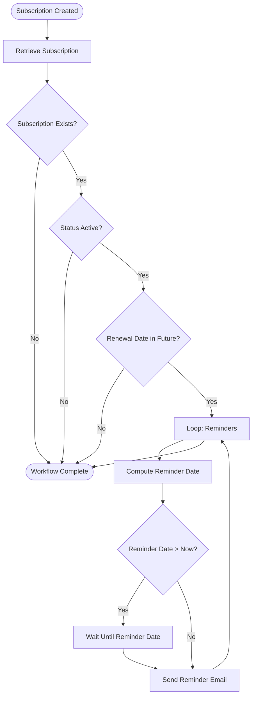

### Subscription Tracker (Backend API)

Designed and built a production-ready RESTful API from scratch, following real-world backend architecture and best practices.

- Developed a Node.js & Express.js server with modular routing, controllers, and middleware to ensure scalability and maintainability

- Implemented JWT-based authentication and authorization, securing private routes and managing user sessions

- Integrated MongoDB with Mongoose, including schema design, data validation, and model relationships

- Built subscription-based business logic, supporting renewals, reminders, and background processing

- Implemented scheduled jobs and background tasks to handle automated subscription workflows

- Manually tested API endpoints using HTTPie

- Containerized the application with Docker and set up CI/CD pipelines using GitHub Actions for automated testing and deployment

** Key Technologies: **
Node.js, Express.js, MongoDB, Mongoose, REST APIs, JWT Authentication, Docker, GitHub Actions (CI/CD), HTTPie, Backend Architecture

------------------------------------------------------------------------------------------------------------------------------------------

### Subscription Reminder Workflow

1. Workflow Trigger

- Initiated when a user creates or submits a new subscription

- The newly created subscription ID is passed into the workflow context

2. Retrieve Subscription Details

- Extracts the subscription ID from the context

- Queries the database for the corresponding subscription

3. Validation Checks

- If the subscription does not exist, logs an error and terminates the process

- If the subscription exists:

   - If inactive → logs status and exits

   - If active → validates the renewal date

4. Renewal Date Evaluation

- If the renewal date has already passed, logs the event and exits

- If the renewal date is in the future, initiates the reminder loop

5. Reminder Scheduling

- Iterates through predefined reminder intervals

- Calculates each reminder date

- If the reminder date is in the future, the system waits until that time

- Once the reminder date arrives (or if it has already passed), sends a reminder email

6. Completion

- Repeats the process for all configured reminders

- Terminates the workflow after all reminders are processed

